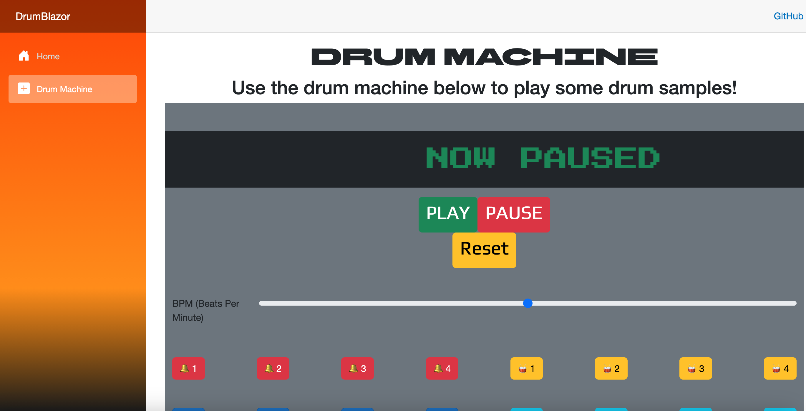
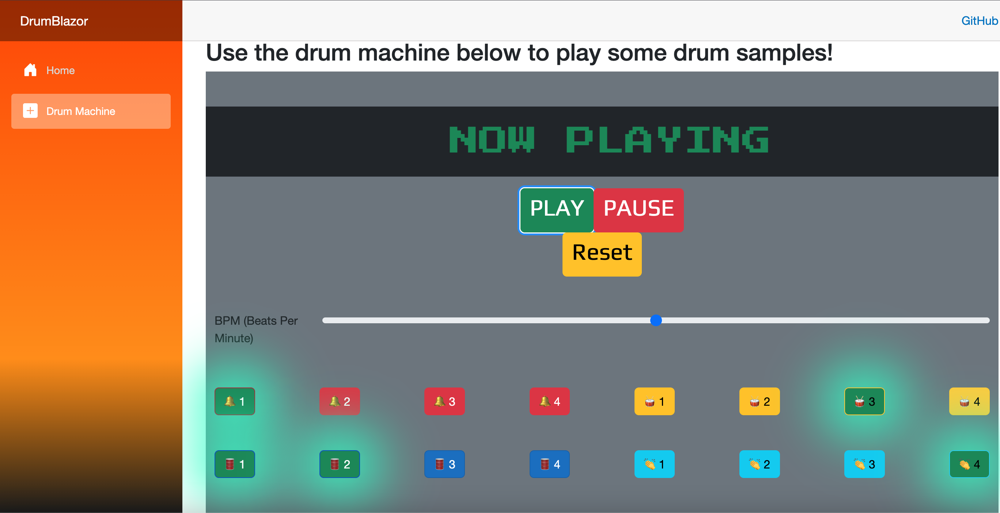

# DrumBlazor
A Blazor C# project that has a built-in drum machine!

# How To Run
Run this terminal command in the 'DrumBlazor' directory, which should spawn a localhost copy of the project:
```
dotnet run dev
```

# Screenshots
NOTE: The center text section scrolls from right to left for reference:



